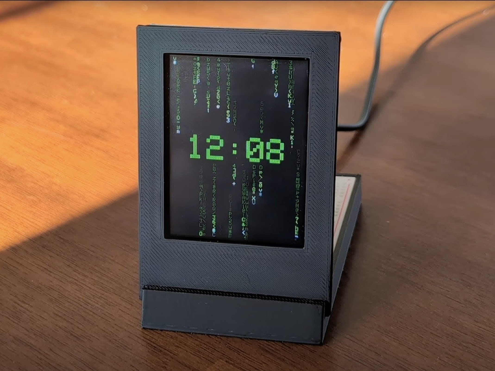

# digital-rain-clock
This repository contains the Arduino code and 3D models required to build a desktop clock that features animated digital rain.

Read the [project guide](https://www.hackster.io/rhammell/digital-rain-clock-inspired-by-the-matrix-49dede) on Hackster.io for a complete project description and build tutorial.

# Project Description

  

Digital rain, or "Matrix Code", is an animated visualization that features columns of text characters that continuously rain down to create a captivating, streaming motion.

This project demonstrates how to build a desktop clock that displays the time against a digital rain background. The digital rain clock is designed as a functional desktop accessory, combining practical timekeeping with a dynamic, eye-catching visualization. Users can enjoy ambient visuals of the rain and use touch interactions to set the time and change its color.

## Features
It features a touchscreen display and integrated control electronics mounted to a custom 3D-printed stand. These electronics are intentionally exposed behind the screen to emphasize a maker-style aesthetic.

*   **Digital Rain Animation**: Once powered via USB, the clock renders a digital rain animation consisting of trails of randomized characters cascading vertically down the screen at varying speeds.
*   **Time Overlay**: At the start of each minute, the current time is overlaid at the center of the screen. After several seconds, the digits gradually dissolve as streaks of digital rain overwrite them. Tapping the center of the screen brings the time back into view on demand.
*   **Touch Controls**:
    *   **Time Adjustment**: Adjusting the current time is done by tapping the top-right corner to open a menu with touch controls for changing the hour and minute values. Tapping the same corner again closes the menu and displays the updated time.
    *   **Color Customization**: The color of the digital rain and time can be updated by tapping the bottom-left corner of the screen. Each tap cycles the interface through green, red, blue, yellow, and purple color schemes.

## Hardware Components
The physical build of the digital clock consists of multiple electronic components and a 3D printed structural stand.

*   **Display**: An **Adafruit 2.8" TFT breakout board** serves as the display that shows the clock face. The board includes a 240x320 pixel full-color display and capacitive touchscreen that detects user touches.
*   **Processor**: An **Arduino Nano ESP32** acts as the clock's primary processor and power source. It connects to the display via the EYESPI breakout and executes custom firmware that manages the rain animation, maintains clock timing, and handles touchscreen input.
*   **Interconnect**: **EYESPI** is a connection standard developed by Adafruit to simplify the wiring of its displays. This standard is utilized by connecting the TFT to an **Adafruit EYESPI breakout board** via an 18 pin FPC.
*   **Stand**: The Nano and EYESPI breakout are wired together on a breadboard that sits within the stand base, while the display is mounted to the upright stand face. The stand face pressure-fits within a slot on the base.
